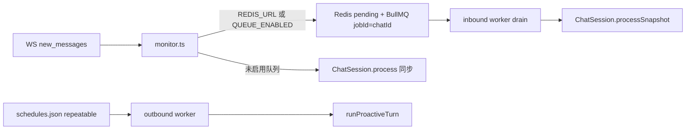

# CocoCat Agent — 队列、可靠性与八项修复

> 本文档描述 **2026-06** 在拟人化基线（[`PLAN-humanize.md`](./PLAN-humanize.md)）之上的增量：BullMQ 入站、reply-guard、thoughtful 两阶段、定时主动消息、transcript 对账等。  
> 实现以 `packages/agent/src/` 为准；偏离时先改本文档。

---

## 1. 架构



- **入站合流**：`SADD cococat:pending:{chatId}` + `queue.add(..., { jobId: chatId })`；BullMQ 无原生 debounce，靠 Redis SET 累积 localId。
- **Drain**：`MULTI` 内 `SMEMBERS` + `DEL`（见 `queue/pending.ts`）。
- **markSeen 铁律**：凡跳过 LLM 的路径（冷却、自说自话、群未 @ 缓冲、triage done、retry 已回复）**必须** markSeen，否则 monitor 无限 re-enqueue。

---

## 2. 群 @ 策略（问题 1）

| 配置 | 默认 | 说明 |
|------|------|------|
| `bridge-groups.json` → `require_mention` | `true` | 群聊需 @ 才触发回复 |
| `reply_with_mention` | **`none`** | **关闭出站 @**；保留 @ 触发 |

示例：[`data/bridge-groups.json.example`](../data/bridge-groups.json.example)

`tools.ts`：仅**首条** `wechat_send_message` 传 `mentions`（与 `reply.ts` fallback 对齐）。

---

## 3. 防连发（问题 2）

`style.json`（`loadChatStyle` 缺字段时用默认值）：

| 字段 | 默认 | 说明 |
|------|------|------|
| `replyCooldownMs` | `30000` | 自动回复后冷却；`0` 关闭 |
| `maxSendsPerTurn` | `1` | 每轮最多发送条数（硬限 5） |

`reply-guard.ts`：冷却期内跳过（**被 @ 时不受冷却限制**）；transcript 尾部连续 4 条 assistant → 跳过（防自说自话）。

环境变量：`WECHAT_REPLY_COOLDOWN_MS` 可覆盖默认冷却。

---

## 4. 记忆与 transcript（问题 3）

- **DirtyMap**（`caption-dirty.ts`）：caption 写入时标记；`hydrateTranscript` 只 patch 脏 localId，**禁止**热路径全量 `stat` 扫描。
- **乱序检测**：`transcriptLocalIdsOutOfOrder`；群 buffer 注入后 `sort by localId`。
- **尾部滑动窗口**（兜底）：`patchTranscriptTailMediaCaptions`，默认最后 **10** 条带 `localId` 的媒体行比对 caption 文件（`CAPTION_TAIL_WINDOW` 可配）。
- **对账 CLI**：
  ```bash
  pnpm agent reconcile-transcript <chatId>
  pnpm agent reconcile-transcript --all
  # 或
  pnpm agent:reconcile --all
  ```

---

## 5. 语音与媒体（问题 4、5）

- **语音**：`resolveVoiceCaptionSync` 同步转写（带超时）；`media.ts` / `payload-hooks.ts` 统一「Agent 已看到转写」语义。
- **表情 type 47**：Driver `get_emoji_media` + Agent 入站识别；出站可用 **`wechat_send_image`**（`localId` 引用聊天内表情/图，或 `path` 本地 gif/png）
- **Driver 发送限速**：`rate_limiter.is_cooling_down()` 在 `messages/send` 前拦截。

---

## 6. Thoughtful 回复（问题 7）

`style.json` → `replyMode`: `"fast"` | `"thoughtful"`；省略时用启发式（长问题、多行等升级）。

两阶段（`thoughtful.ts` → `runThoughtfulTurn`）：

1. **Ack**（可选）：`style.json` → `thoughtfulAck: true` 或 `WECHAT_THOUGHTFUL_ACK` → 先发「我看下」类短句（不经 tool 计数）
2. **Gather**：禁 `wechat_send_*`，收集要点  
3. **Reflect**（可选）：`thoughtfulReflect` / `WECHAT_THOUGHTFUL_REFLECT` → 模型回复 `GAP:…` 时补一轮 Gather  
4. **Compose**：正常回复

### 入站 / outbound 隔离（队列启用时）

| 路径 | 行为 |
|------|------|
| **inbound worker** | 检测到 thoughtful → `enqueueInboundThoughtfulReply` → 只写 user transcript + markSeen，**立即释放** inbound job |
| **outbound worker** | `inbound_thoughtful_reply` → `runInboundThoughtfulReply`（Gather→Compose→发送） |
| **合流** | Redis `cococat:thoughtful_pending:{chatId}` + `jobId=inbound-thoughtful:{chatId}`；运行期间新消息累积 pending，完成后 `ensureThoughtfulOutboundJob` 再排 |

`inbound_thoughtful_reply` **不受**主动消息 allowlist / quiet hours 限制（这是对用户消息的回复，非 cron）。

无队列时：仍在 `session.processUnseen` 内同步两阶段。

主动任务 / `schedule_agent_turn` 的 `thoughtful_turn` 仅在 outbound worker 内 inline 执行。

---

## 7. 队列与 Cron（问题 6、8）

### 启用队列

| 变量 | 说明 |
|------|------|
| `REDIS_URL` | 如 `redis://127.0.0.1:6379`；设置后**默认启用**队列 |
| `QUEUE_ENABLED` | `true`/`false` 显式开关；`true` 且无 `REDIS_URL` 时用默认 `redis://127.0.0.1:6379` |
| `QUEUE_CONCURRENCY` | inbound worker 并发，默认 `4` |

`docker compose up -d` 已包含 `redis:7-alpine`。

未启用队列时：`monitor.ts` 仍走同步 `ChatSession.process()`。

### 定时任务

复制 [`data/schedules.json.example`](../data/schedules.json.example) → `~/.config/cococat/schedules.json`。

- `quietHours`：主动消息静默时段  
- `jobs[]`：BullMQ repeatable cron  
- 队列启用时 Agent 工具：`schedule_message`、`schedule_agent_turn`

**用户回复取消延迟任务**：本 chat 有新入站消息（inbound worker drain 后或同步 `processUnseen` 开头）时，`cancelPendingOutboundForChat` 会移除该 chat 所有 `delayed`/`waiting` 的 `send_text` / `run_agent_turn` / `thoughtful_turn`（**不**取消 `inbound_thoughtful_reply`）。

---

## 8. Worker 可靠性

入站 worker 处理顺序（`queue/worker.ts`）：

1. `drainPendingLocalIds` / fallback unseen
2. **`cancelPendingOutboundForChat`**（用户活动 → 取消延迟提醒/排期）
3. `snapshotAlreadyAnswered` → markSeen，跳过（retry 防双发）
4. **`evaluateInboundFastDiscard`**（`queue/fast-discard.ts`）→ markSeen，**不进 ChatSession**
5. `processSnapshot(..., { replyGuardChecked: true })`

Fast-discard 覆盖（均 markSeen）：

| reason | 条件 |
|--------|------|
| `muted_customer` | 私聊 escalation 静音 |
| `group_buffer` | 群需 @ 但未 @ → 写入共享 `groupBuffers` |
| `cooling_down` | 冷却期内且未 @ |
| `self_talk` | transcript 尾部连续 assistant（读磁盘，不 hydrate） |

同步路径（无队列）仍在 `session.processUnseen` 内跑完整分支 + `evaluateReplySkip`。

---

## 9. 环境变量补充

| 变量 | 说明 |
|------|------|
| `REDIS_URL` | Redis 连接 |
| `QUEUE_ENABLED` | 队列开关 |
| `QUEUE_CONCURRENCY` | Worker 并发 |
| `WECHAT_REPLY_COOLDOWN_MS` | 全局回复冷却 |
| `CAPTION_TAIL_WINDOW` | transcript 尾部 caption 兜底条数，默认 10 |
| `BRIDGE_REPLY_WITH_MENTION` | 覆盖默认 `none` |
| `BRIDGE_GROUPS_CONFIG` | 群策略文件路径 |

完整拟人化变量见 [`PLAN-humanize.md` §18](./PLAN-humanize.md#18-环境变量索引)。

---

## 10. 验收清单

- [ ] 设 `REDIS_URL` 后启动 Agent 日志显示 `queue: enabled`
- [ ] 同群连发两条消息 → 仅一个 inbound job，snapshot 含两条 localId
- [ ] 冷却期内第二条 trigger → skip + markSeen，不 infinite enqueue
- [ ] `reconcile-transcript --all` 无报错
- [ ] `schedules.json` 中 enabled job 到点触发（或 outbound 日志）
- [ ] 群 @ 触发回复但出站文字**无** `@某人`
- [ ] 语音消息当轮 prompt 含转写语义
- [ ] `pnpm --filter @cococat/agent test` 中 `queue smoke` 通过（pending 合流 / thoughtful 卸载判定）
- [ ] `thoughtfulAck` + `thoughtfulReflect` 按 chat 启用后行为符合预期

---

*文档版本：2026-06-10，与八项修复计划对齐。*
