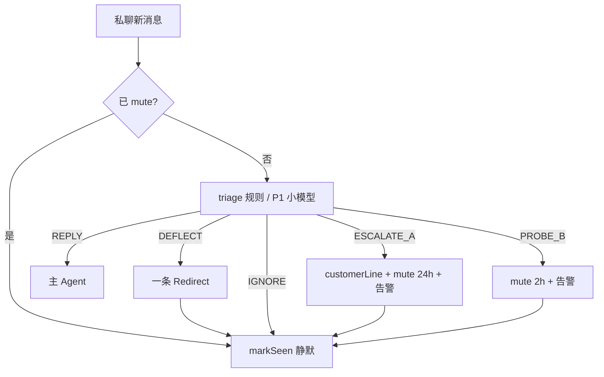

# CocoCat 分流 + 转人工 + 维护者通道

本文档汇总 **grill 定稿**（2026-06）：私聊场景下的「该不该回」、试探应对、维护者微信告警与 mute。与 [`PLAN-humanize.md`](PLAN-humanize.md)（拟人话术/节奏）并列；**分流与转人工以此为准**。

群聊场景 **搁置**；实现仅对 **私聊** 启用 triage（群聊仍走原有 @ 策略）。

---

## 1. 目标

- 客户消息不必「有话必回」；试探 / 恶搞 / 真搞不定时行为可控
- **品牌官方口吻**（「我们」「这边」），不具名客服
- **维护者**（指定微信联系人）在 A/B 类事件时立刻收到结构化告警
- 转人工或升级后 **mute 客户会话**，避免 AI 与客户继续杠
- 维护者可用 **简单微信指令** + Console 解除 mute

---

## 2. Grill 决策一览

| # | 议题 | 定稿 |
|---|------|------|
| 1 | 主场景 | **私聊**；群聊搁置 |
| 2 | 人设 | **B — 品牌官方口吻** |
| 3 | 身份试探 | **DEFLECT 一次 → 之后静默**；连续 **2** 条仍纠缠 → **B 级升级** |
| 4 | 维护者通知 | **A** 真转人工 + **B** 试探升级；**C** 低置信实现但 **默认关闭** |
| 5 | mute 策略 | **D** — 定时 + Console/微信可提前解除 |
| 6 | mute 时长 | **A → 24h**；**B → 2h** |
| 7 | 维护者绑定 | Console 点选；存 **chatId + displayName**；发送 chatId 优先 |
| 8 | 解除 mute | **Console + 微信**；指令 `已处理` / `解除` / `列表`；多个 mute 时追问 |
| 9 | triage 实现 | **C — 规则 MVP**（P0）；小模型 JSON 分流 **P1** |

---

## 3. 客户侧分流



| 动作 | 条件（P0 规则） | 对客户 |
|------|-----------------|--------|
| **REPLY** | 未命中特殊类 | 正常 `agent.prompt()` |
| **DEFLECT** | 首次身份/AI 试探 | `deflectLine` 一条 |
| **IGNORE** | DEFLECT 后试探未达 B 阈值；非业务空撩 | 不回 |
| **ESCALATE_A** | 转人工/投诉/高风险词等 | `customerLine` + mute 24h |
| **PROBE_B** | DEFLECT 后连续 2 条仍试探 | mute 2h（不发 customerLine，可选） |

默认文案（`escalation.json` 可覆盖）：

- `deflectLine`：「这边是在线客服，有业务问题可以直接说～」
- `customerLine`：「这边已记录，同事会尽快联系您。」

---

## 4. 维护者通道

维护者会话 = **控制面**，不走客服 Agent / triage。

| 指令 | 行为 |
|------|------|
| `列表` | 回复当前 mute 列表（备注名 + 剩余时间 + 原因） |
| `已处理` / `解除` | 仅 1 个 mute → 直接解除；多个 → 追问序号或名字 |
| 回复 `1` / 备注名 | 在「待选择」状态下解除对应会话 |

告警模板（发给维护者，1～2 条微信）：

```
【需处理】CocoCat
客户：{chatName}
chatId：{chatId}
触发：{escalate_a | probe_b}
原因：{triage reason}
最近原话：
- …
对客户：已发/未发 customerLine
mute：{2h | 24h}
```

---

## 5. 配置与状态文件

### 5.1 `~/.config/cococat/escalation.json`

见仓库 [`escalation.json.example`](../escalation.json.example)。

### 5.2 运行时状态

```
~/.local/share/cococat/escalation/
  mutes.json              # 全局 mute 表
  maintainer-session.json   # 维护者控制面待选状态

~/.local/share/cococat/chats/{encodeChatDir}/
  escalation-state.json     # per-chat：deflect 已发、试探连击计数
```

---

## 6. 实施阶段

| Phase | 内容 | 状态 |
|-------|------|------|
| **P0** | 规则 triage + mute + 维护者告警 + 微信指令 + 发送队列 | ✅ |
| **P1** | 小模型 triage（`triage.useLlm`）；触发器 C 低置信 FYI（默认关） | ✅ |
| **P2** | Console Agent「分流」Tab：维护者点选、配置、mute 列表与解除 | ✅ |

---

## 7. 与 PLAN-humanize 关系

- **humanize**：怎么回（纪律层、delay、拆句、记忆、wiki）
- **escalation（本文）**：**是否回**、何时转人工、维护者运维

两者同时生效：triage 放行后的轮次仍遵守 humanize 纪律层。

---

## 8. 验收清单（P0）

- [ ] 私聊首次「你是机器人吗」→ 只发 deflectLine，不再辩
- [ ] 连续 2 条试探 → 维护者收到告警，客户 mute 2h
- [ ] 「转人工」→ customerLine + mute 24h + 维护者告警
- [ ] mute 期间客户再发 → 不回，markSeen
- [ ] 维护者发「列表」→ 看到 mute 会话
- [ ] 维护者发「已处理」→ 解除（多会话时追问）
- [ ] 群聊行为与升级前一致

---

*文档版本：grill 定稿 2026-06-09。*
