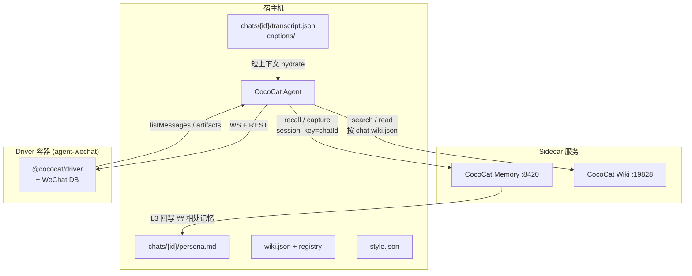

# CocoCat Agent 拟人化 + 记忆 — 实施计划

本文档汇总 grill 定稿的全部设计决策，并标注 **TencentDB Agent Memory** 引入后与早期方案的衔接/取代关系。实现时以此为准。

**分流 / 转人工 / 维护者通道**见 [`PLAN-escalation.md`](PLAN-escalation.md)（与本文互补：本文管「怎么回」，escalation 管「是否回」）。

---

## 1. 目标

- 微信里像真人聊天（可可猫人设），不像 API 助手
- 按 **chatId** 隔离：人设、记忆、wiki 库、群规、节奏
- **短期**记得住当前对话；**长期**记得住偏好与相处方式
- 不把「查记忆 / 查 wiki / 发工具回执」暴露给用户

---

## 2. 架构总览



### 2.1 三套「记忆」分工（易混，必读）

| 层 | 存储 | 职责 | 真相来源 |
|----|------|------|----------|
| **短上下文 transcript** | `chats/{id}/transcript.json` | 最近 N 轮精确对话（含 caption 文字）；重启后 pi-agent 立即可用 | 微信 DB（`isSelf` 对齐）+ 本地 checkpoint |
| **长期记忆 TencentDB** | sidecar 内 SQLite/L0–L3 | 偏好、事实原子、场景、**相处 persona**；语义 recall | TencentDB 管线 |
| **知识库 CocoCat Wiki** | `:19828` | 外部资料/笔记（多 project），**不是**聊天记忆 | wiki 源文件 |

**不矛盾**：transcript 管「刚才说了啥」；TencentDB 管「长期你是谁、TA 喜欢怎样」；wiki 管「查资料」。

**已废弃**：自研「每 N 轮 LLM 改写 persona.md」（Grill #10 B+）→ 由 **TencentDB L3 + 回写 `## 相处记忆`** 取代。

**未采用**：[agentmemory](https://github.com/rohitg00/agentmemory)（coding-agent 向、MCP 工具过多，不适合微信拟人）。

---

## 3. 目录与配置布局

```
~/.config/cococat/
  persona.md                 # 全局种子（只读模板，人工维护）
  persona.example.md         # 仓库示例
  agent.env                  # LLM / pi 配置（原 pi-wechat.env）
  memory.env                 # Memory 提炼 LLM（原 tencentdb-memory.env）
  wiki-registry.json         # "工作" → projectId
  wiki-default.json          # 可选默认 projects 列表
  bridge-groups.json         # 仅群 @ 规则（require_mention 等）
  token                      # Driver API token

~/.local/share/cococat/
  chats/{encodeChatDir(chatId)}/
    meta.json                # chatId, lastLocalId, …
    persona.md               # ## 核心性格 + ## 相处记忆
    style.json               # groupMode, delays, …
    wiki.json                # { "projects": ["工作", "生活"] }
    transcript.json          # pi 短上下文
    seen.json                # 已处理 localId（触发用）
    memory/captions/{localId}.txt
  memory/                    # CocoCat Memory 数据卷
  wechat-home/ data/         # Driver Docker 绑定目录
```

**升级**：从 `~/.config/agent-wechat` 运行 `pnpm migrate` 一次性复制。

### 3.1 `encodeChatDir`

- `12345678@chatroom` → `_12345678_chatroom`
- `meta.json` 存真实 `chatId`

### 3.2 lazy fork（首次处理该 chat）

1. 创建目录
2. 复制全局 `persona.md` → `## 核心性格`（此后**锁定**，TencentDB 不覆盖）
3. 初始化空 `## 相处记忆`、默认 `style.json` / `wiki.json`（可选从全局默认继承）

---

## 4. System Prompt 组装顺序

**优先级从高到低**（实现时在代码里拼接，`onPayload` 对 MiMo **整段替换** `role: system`）：

| 顺序 | 块 | 可被人改？ | 说明 |
|------|-----|-----------|------|
| 1 | **纪律层** | 否（代码写死） | 见 §5 |
| 2 | **场景** | 动态 | `当前：私聊` / `当前：群聊「{name}」` |
| 3 | **TencentDB recall** | 自动 | 有则注入 `【长期记忆】…`；失败/超时**静默跳过** |
| 4 | **persona.md** | 人工+同步 | 读 `chats/{id}/persona.md`；无目录则临时读全局 |
| 5 | **Wiki 拟人 append** | 配置 | 仅 `WIKI_ENABLED`；见 §11 |
| — | **`WECHAT_PI_SYSTEM_PROMPT`** | env | **若设置则替换 3–5 块**（不含纪律层、不含场景行） |

**与旧 `prompt.ts` 的差异**：删除英文 `via tools`、删除「exactly once」等已被 §5 取代的表述。

---

## 5. 纪律层（代码写死，evolution 不可改）

1. 每轮 **1～5 条**微信；默认 1 条；白名单场景（先 reaction 再正文、长文拆句、多要点）才多发；**硬限 5**
2. 禁止 markdown 列表 / AI 腔 / 提 tool、API、转写、wiki、记忆检索
3. 图/音/视频当真人感知；自然文字回复
4. 禁止「我是 AI / 助手 / 模型」
5. 匹配用户语言；句子偏短，像打字

**实现**：`beforeToolCall` 计数 ≤5；**去掉** `afterToolCall` 首条 `terminate`；多条间 `burstDelayMs`（§10）。

---

## 6. 入站消息格式（user 块）

| 场景 | 格式 |
|------|------|
| 私聊 | 首行 `（对方新消息）` + 连发换行；**无** `Leaif:` |
| 群聊 | `{senderName}: {text}` |
| 图片 | `（发了一张图）` + 多模态；历史/caption：`（发了一张图：{客观摘要}）` |
| 语音 | 同上 + `input_audio`；**同步** caption（`resolveVoiceCaptionSync`，带超时）；历史行：`（发了一条语音：…）` |
| 加载失败 | `（发了一张图，但这边没加载出来）` |
| 链接等 | 能解析则带 URL/标题（Grill #15 B）；视频 v1 封面 caption |
| 同一轮多条 | **一个** user 块，换行分隔（Grill #16 A） |

**删除**：`[Chat: wxid | … | group]` 调试头（Grill #11 A）。

**bot 自知**：user 块**仅**含 `!isSelf`；bot 历史在 pi `assistant` / transcript / TencentDB capture。

---

## 7. 短上下文 transcript（H 段）

### 7.1 加载时机（H2 A+C）

- chat **首次** `process()`：有 `transcript.json` → 载入 pi-agent；否则从**微信 DB** 灌入
- 不对所有 chat 预加载

### 7.2 灌库规则（H3）

- N 可配，默认 **40**（`WECHAT_PI_HISTORY_LIMIT` 或 `style.json`）
- `isSelf` → `assistant` **纯文本**（非伪造 tool）
- 群：他人 → `user` 带 `名字:`
- 图/音：**caption 文字**（H6 A），不重新拉 artifact

### 7.3 对账（H4 C）

- `meta.lastLocalId` 与 DB 一致 → **增量 append** transcript
- 不一致 → **丢弃 transcript**，DB 全量重灌

### 7.4 seen（H5 C）

- `chats/{id}/seen.json`：只决定**是否触发**新回复
- **不能**替代 transcript/recall

### 7.5 与 TencentDB 的关系

| 问题 | 结论 |
|------|------|
| 是否重复？ | transcript = 精确近期；recall = 提炼远期。**都保留** |
| 重启后 bot 不知自己说过啥？ | transcript hydrate + TencentDB capture 历史 **同时**解决 |
| L3 取代 transcript？ | **否**。recall 不会带全量逐字稿 |

---

## 8. Caption 服务（H6–H7）

- **时机**：新图/音进入 CocoCat Agent 时（A）
- **风格**：客观一句（A）
- **实现**：**独立**小 LLM 请求（H7 A），结果写 `memory/captions/{localId}.txt`
- **用途**：transcript 行、TencentDB capture、历史灌库
- **当轮回复**：仍可走 MiMo 多模态；caption 不阻塞主回复

Caption 模型：可与提炼共用 DeepSeek flash，或 MiMo——**实现时 env 可配**，默认 DeepSeek 省 MiMo 额度。

---

## 9. TencentDB Agent Memory（M 段）

参考：[TencentDB-Agent-Memory](https://github.com/TencentCloud/TencentDB-Agent-Memory)

### 9.1 部署（M2）

- Docker sidecar，`http://127.0.0.1:8420`
- 数据卷：`~/.local/share/cococat/memory/`
- `session_key` = 微信 `chatId`（一 chat 一记忆空间）

### 9.2 recall（M3）

- HTTP `recall` → 并进 **system**（纪律层之后）
- `recall.timeoutMs` 超时则跳过，不阻塞聊天
- 策略：`hybrid`，`bm25.language: zh`

### 9.3 capture（M5）

每轮结束后 capture **对话正文**：

- 对方消息（含 caption 后的图/音/链接行）
- bot `wechat_send_message` 发出的文字
- **不含** tool 轨迹、不含 `Message sent`

### 9.4 persona 双写（M4）

```
## 核心性格      ← lazy fork 自全局 persona.md，锁定
## 相处记忆      ← TencentDB L3 定期回写（Agent syncPersonaL3）
```

- TencentDB 内部也有 L3 `persona.md`；本地文件是**白盒镜像**
- 全局 `~/.config/.../persona.md` **仅种子**，已 fork 的 chat **不**随全局变

### 9.5 提炼 LLM（M6）

| 用途 | 模型 | 配置 |
|------|------|------|
| 微信回复 | `mimo-v2.5` | `agent.env` / 小米 Coding Plan |
| L1/L2/L3 提炼 | `deepseek-v4-flash` | `tencentdb-memory.env` → Gateway `llm.*` |

Embedding：TencentDB 默认本地 sqlite-vec + jieba（zh），无需额外 API。

初始管线参数（可调）：`everyNConversations=5`，`persona.triggerEveryN=50`。

### 9.6 不给 Agent 的记忆工具

- **禁止**向 pi 暴露 `tdai_memory_*` / `wiki_list_projects` 等
- 仅 CocoCat Agent 宿主代码在 prompt 前/后自动 recall/capture

---

## 10. 工具层（#3）

| 工具 | 暴露？ | 说明 |
|------|--------|------|
| `wechat_send_message` | ✅ | 中文 description |
| `wechat_send_image` | ✅ | 发图片/表情（localId 或本地 path） |
| `wechat_list_messages` | ✅ | 描述写「上下文不够时再翻」；返回格式同 §6 |
| `wechat_auth_status` | ❌ | 从 Agent 列表移除 |
| `wechat_list_chats` | ❌ | 从 Agent 列表移除 |
| `wiki_search` / `wiki_read_page` | ✅（WIKI_ENABLED） | 中文描述；拟人 append |

**回执**：send 成功 → `ok`（静默）；list 无 ISO 时间戳，bot 行用 `我:`。

---

## 11. Wiki 多库（#5）

- `wiki-registry.json`：别名 → projectId
- `chats/{id}/wiki.json`：`{ "projects": ["工作", "生活"] }`
- search：每库 topK → **score 全局排序**（Grill #26 A）
- read_page：path = `工作/wiki/foo.md`（Grill #27 A）
- append：查到了像自己记得，别提 wiki

**与 TencentDB**：wiki = 外部知识；TencentDB = 聊天记忆。**不合并存储**。

---

## 12. 出站兜底（#4）

- 未 call send 时 fallback：去 markdown → 按 **。！？；** 拆句 → 最多 5 条
- MiMo `reasoning_content`：`onResponse` 剥离 + 发送前再滤（#9 A+B）

---

## 13. 群策略（#8）

`style.json`：

```json
{
  "groupMode": "bot",
  "replyDelayMs": null,
  "burstDelayMs": [400, 900]
}
```

| groupMode | require_mention | reply @ |
|-----------|-----------------|---------|
| `bot`（默认） | 沿用 `bridge-groups.json` | 沿用 |
| `member` | **false** | 出站 **不 @**（`reply_with_mention: none`，与 bot 默认一致） |

`bridge-groups.json` **只管 @**；与 persona/wiki 目录**并存**（Grill #3 A）。

---

## 14. 回复节奏（#7）

- 全局默认 **不**延迟
- per-chat：`replyDelayMs: [800, 2000]` 在 **首条 send 前**（模型算完后）
- 多条 send 间：`burstDelayMs`（#29 B）

---

## 15. 多消息类型 v1（#6）

- **P0+P1**：视频（封面 caption，整段 MiMo 待 Driver 自动下载）、链接解析
- 视频：目标 MiMo 整段（#31 B）；过渡 A now + B later（#32）
- **表情 type 47**：入站识别 + transcript/reconcile 行 `（发了一个表情）`；出站 **`wechat_send_image`**（`localId` / 本地 path，见 [`PLAN-agent-queue.md`](./PLAN-agent-queue.md)）

---

## 16. 矛盾检查表

| 早期说法 | 后来决定 | 结论 |
|----------|----------|------|
| persona 每 N 轮自研 summarizer 改 md | TencentDB L3 | **取代** summarizer；只 sync `## 相处记忆` |
| transcript 为唯一重启历史 | + TencentDB recall | **并存**；分工见 §2.1 |
| 微信 DB 为 transcript 真相 | TencentDB 为 L1–L3 真相 | **不同域**；各管各的 checkpoint |
| 全局 persona 参与每轮 merge | fork 后 chat 文件 + L3 回写 | 全局**仅种子**；不 merge 追加 |
| 每轮只发 1 条 | 1～5 条 + burst | **更新**纪律层 §5 |
| `seen.json` 全局 | per-chat | **迁移**；与 transcript 职责仍分离 |
| agentmemory / 53 MCP | TencentDB sidecar | **选用 TencentDB** |
| MiMo 管记忆提炼 | DeepSeek flash 提炼 | **分离**；MiMo 仅对话 |
| list_messages 在 prompt 里提 | 只在 tool 中文描述 | **更新** prompt 结构 §4 |
| Grill #5 C 分层 merge persona | fork + L3 回写 | **演进为** M4 双写；更简单 |

**未发现未决议冲突**。若实现中 recall 与 transcript  token 过长，优先调低 N / `recall.maxTotalRecallChars`，而非删一层。

---

## 17. 实施阶段

| Phase | 内容 |
|-------|------|
| **0** | TencentDB sidecar compose、env 模板、`tencentdb-memory.env.example` |
| **1** | chat 目录、encodeChatDir、persona fork、纪律层、system 组装、MiMo onPayload |
| **2** | transcript + seen 迁移 + caption 服务 + DB hydrate |
| **3** | 入站格式 `media.ts` |
| **4** | 工具精简、1～5 send、fallback、reasoning 过滤 |
| **5** | wiki 多库 + registry |
| **6** | `MemoryClient` recall/capture/L3 sync |
| **7** | style.json 群模式 + delays |
| **8** | 视频/链接类型 |

建议 **Phase 1→4 可先无 TencentDB 跑通拟人化**，Phase 6 再接 sidecar（recall/capture 可 stub 为空）。

---

## 18. 环境变量索引

| 变量 | 说明 |
|------|------|
| `WECHAT_PI_SYSTEM_PROMPT` | 可选，覆盖 persona+wiki 段 |
| `WECHAT_PI_HISTORY_LIMIT` | transcript 条数，默认 40 |
| `WECHAT_PI_BURST_DELAY_MS` | 全局 burst 默认 |
| `WIKI_ENABLED` / `WIKI_API_URL` | CocoCat Wiki API |
| `WIKI_PROJECT_ID` | wiki 全局默认（可被 chat `wiki.json` 覆盖） |
| `TDAI_GATEWAY_URL` | 默认 `http://127.0.0.1:8420` |
| `TDAI_LLM_*` | DeepSeek → Gateway 提炼模型 |
| `XIAOMI_TOKEN_PLAN_CN_API_KEY` / `PI_MODEL` | MiMo 对话 |

密钥**只**放 `~/.config/cococat/*.env`，chmod 600，**勿提交 git**。

---

## 19. 队列与八项修复（2026-06 增量）

在拟人化基线之上的可靠性补丁：**BullMQ + Redis 入站合流**、reply-guard 冷却、`thoughtful` 两阶段、schedules 主动消息、transcript 对账 CLI 等。

**详述**：[`PLAN-agent-queue.md`](./PLAN-agent-queue.md)（实现与 env 以该文档为准）。

与本文档的要点差异：

- 群默认 `reply_with_mention: "none"`（保留 @ 触发，关闭出站 @）
- `style.json` 新增 `replyCooldownMs`、`maxSendsPerTurn`、`replyMode`
- 语音 caption **同步**转写（非仅异步旁路）
- transcript：DirtyMap + 尾部媒体 caption 滑动窗口兜底

---

## 20. 验收清单

- [ ] 私聊连发 3 句 → 一个 user 块，回复自然，无 `[Chat:…]`
- [ ] 重启 Agent → 仍知近期对话（transcript）+ 远期偏好（recall）
- [ ] 发图 → 当轮能看图回复；caption 文件存在；capture 后 L1 可查
- [ ] 两 chat 不同 `wiki.json` → 搜到不同库
- [ ] `member` 群不 @ 也回；出站不重复 @（`reply_with_mention: none`）
- [ ] 无 reasoning / markdown 泄漏到微信
- [ ] 最多 5 条连发，条间有延迟

---

*文档版本：grill 定稿 2026-06-07。实现偏离时需先更新本文档。*
