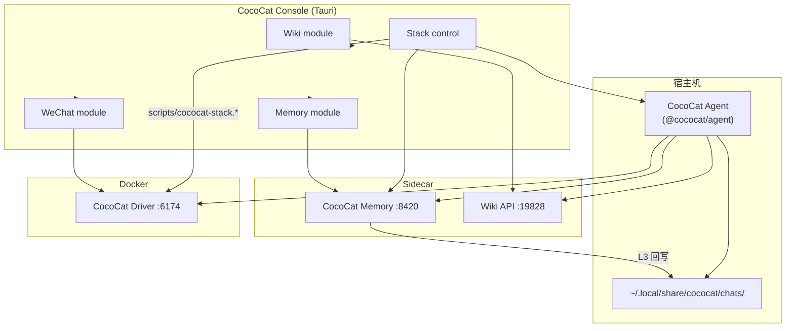

# CocoCat 合并计划 — llm_wiki + agent-wechat + Memory

本文档汇总 **grill 定稿** 的全部设计决策：品牌统一、根 monorepo、**CocoCat Console** 统一前端、配置目录迁移。实现时以此为准；拟人化行为仍以 [`docs/PLAN-humanize.md`](PLAN-humanize.md) 为准；**Console 壳层交互与 UI 实施阶段**见 [`docs/PLAN-console-ux.md`](PLAN-console-ux.md)。

---

## 1. 目标

- **对外统称 CocoCat**：微信 AI 伙伴（可可猫），Wiki / Memory 为聊天服务的能力，非并列产品
- **一个桌面入口**：CocoCat Console（由原 llm_wiki Tauri 壳演进）管理 Wiki、WeChat 运维、Memory 调试、栈启停
- **根 monorepo**：代码与文档收拢到 `Wechat-Cococat/`，历史目录逐步废弃
- **配置统一**：`~/.config/cococat/` + `~/.local/share/cococat/`；旧 `agent-wechat` 通过 `pnpm migrate` 一次性迁移

---

## 2. Grill 决策一览

| # | 议题 | 定稿 |
|---|------|------|
| 1 | 产品边界 | **A — WeChat 优先**；Wiki / Memory 从属 CocoCat |
| 2 | 仓库布局 | **2A — 根 monorepo** |
| 2b | Wiki 数据 | **2A-1 — Agent 只存 project 映射**；正文在 Wiki 注册目录 |
| 3 | 统一前端 | **U-A-1 — llm_wiki 演进为 CocoCat Console**；Wiki 为侧栏模块 |
| 4 | WeChat 模块 | **W-1 — 运维面板**（状态、登录、VNC、只读会话；M1 不发消息） |
| 4b | 栈启停 | **W-1b — Console 一键启停 Driver + Memory + Agent** |
| 5 | Memory 模块 | **M-1 — 只读调试台**（health、试 recall、capture 摘要、L3 只读） |
| 6 | 配置目录 | **6A — 迁移至 `~/.config/cococat/` 与 `~/.local/share/cococat/`** |

术语见仓库根 [`CONTEXT.md`](../CONTEXT.md)。

---

## 3. 架构总览



### 3.1 与 PLAN-humanize 的关系

| 文档 | 范围 |
|------|------|
| **PLAN-humanize** | Agent 行为：拟人化、transcript、persona、discipline、工具、TencentDB recall/capture |
| **PLAN-merge-cococat（本文）** | 仓库结构、Console UI、栈启停、配置路径、品牌 |

**不改动** humanize 里的记忆分工（transcript / Memory / Wiki 三套存储）。仅将 humanize §3 中的 `~/.config/agent-wechat` 路径 **视为待迁移的旧路径**；canonical 见 §5。

---

## 4. Monorepo 目标布局

**目标结构**（分阶段迁入，M1 可先「逻辑 monorepo + 物理 symlink」）：

```
Wechat-Cococat/
├── CONTEXT.md
├── docs/
│   └── PLAN-merge-cococat.md          # 本文
├── pnpm-workspace.yaml
├── package.json                       # cococat 根脚本：dev、stack、agent
├── apps/
│   └── console/                       # 原 llm_wiki（Tauri + React）
│       ├── src/
│       └── src-tauri/
├── packages/
│   ├── agent/                         # 原 packages/agent
│   ├── driver/                        # 原 packages/driver + docker
│   ├── cli/                           # 原 @cococat/cli
│   └── shared/
├── scripts/                 # stack, migrate, driver build
├── docker-compose.yml
└── AGENT.md
```

**npm 包名（M3）**：`@cococat/console`、`@cococat/agent`、`@cococat/driver`、`@cococat/cli`、`@cococat/shared`。

**Wiki API**：由 Console 内 Rust `api_server` 在 `:19828` 启动。

---

## 5. 配置与数据目录（6A）

### 5.1 Canonical 布局

```
~/.config/cococat/
  console.json              # 栈路径、启停偏好、模块 UI 状态
  token                     # Driver API token
  persona.md                # 全局 persona 种子
  agent.env                 # 原 pi-wechat.env
  memory.env                # 原 tencentdb-memory.env
  wiki-registry.json
  bridge-groups.json

~/.local/share/cococat/
  chats/{encodeChatDir}/    # 同 PLAN-humanize（transcript、persona、wiki.json…）
  memory/                   # TencentDB 数据卷（原 tencentdb-memory/）
  stack/                    # PID 文件、agent 日志路径约定
    driver.pid
    memory.pid
    agent.pid
```

Wiki **project 正文**仍在用户自选目录 + `{project}/.llm-wiki/`；Console `app-state.json`（project 注册表）M1 仍用 Tauri `com.cococat.app` app data，**M2** 可选迁入 `~/.local/share/cococat/console-app-state.json`。

### 5.2 迁移策略（M3）

1. **`scripts/cococat-migrate-config.sh`**（`pnpm migrate`）：若新目录不存在且旧目录存在，复制 `agent-wechat` → `cococat`
2. **Agent 代码**：只读写 `~/.config/cococat/` 与 `~/.local/share/cococat/`（可用 `COCOCAT_*` env 覆盖）
3. **CLI / Wechaty / shared**：token 与 Docker 卷优先 cococat；**只读**回退 legacy 路径（未迁移时）
4. **Console 首次启动**：提示运行 `pnpm migrate`（若检测到 legacy 目录）
5. **文档**：humanize / setup 以 cococat 路径为准；Docker 镜像名仍为 `agent-wechat`（上游兼容）

---

## 6. CocoCat Console 模块规格

### 6.1 壳与导航

- 应用名：**CocoCat**（已 `tauri.conf.json` `productName: CocoCat`）
- 侧栏：**Wiki** | **WeChat** | **Memory** | **Agent**（配置，M2 可合并进 WeChat）
- Wiki 模块：保留现有 llm_wiki 功能，作为默认 landing 亦可配置

### 6.2 WeChat module（W-1）

| 功能 | M1 |
|------|-----|
| Driver health (`/api/status`) | ✓ |
| 登录 QR（WS `/api/ws/login`） | ✓ |
| 嵌入 VNC `http://localhost:6174/vnc/` | ✓ |
| 只读会话列表 | ✓ |
| Console 内发消息 | ✗ |
| 群 bridge 可视化编辑 | M2 |

### 6.3 Memory module（M-1）

| 功能 | M1 |
|------|-----|
| Gateway health | ✓ |
| 按 session_key 试 `POST /recall` | ✓ |
| 最近 capture 摘要（只读） | ✓ |
| L3 → persona `## 相处记忆` 只读预览 | ✓ |
| 编辑 / 删除 L1 条目 | ✗（M2+ 再议） |

### 6.4 Stack control（W-1b）

Console 顶部或独立 **「栈」** 面板：

| 服务 | 探测 | 启停 |
|------|------|------|
| Driver | `:6174/api/status` | `docker compose` / `wx up` / `wx down` |
| Memory | `:8420` health | `scripts/start-tencentdb-gateway.sh` 或 compose |
| Agent | PID file + 可选 HTTP 心跳 | `pnpm --filter @cococat/agent start` |

**聚合按钮**：「启动全部」「停止全部」（顺序：Driver → Memory → Agent；停止逆序）

**实现**：

- Tauri `invoke('stack_command', { action, service })` → Rust 调 `scripts/cococat-stack.{sh,ps1}`
- 每平台独立脚本；Rust 仅选平台 + 传 monorepo 根路径（来自 `console.json` 或编译时 env）
- **失败 UX**：展示 stderr；Docker/sudo 失败时给出可复制 CLI（不静默）

**进程约定**：

- PID + log 写入 `~/.local/share/cococat/stack/`
- Agent 启动前检查 Driver logged_in；Memory 可选（Agent 可静默跳过 recall）

---

## 7. 实施分期

### Phase M1 — 可运行的合并骨架（优先）

- [x] 根 `pnpm-workspace.yaml` + 文档指向 CocoCat
- [x] `paths.ts` / `config.ts` 支持 `~/.config/cococat`（M3 移除 Agent 运行时 legacy 回退）
- [x] `cococat-migrate-config.sh`
- [x] `cococat-stack.sh`（linux）+ Console 壳内 **Stack** 面板（最小 UI）
- [x] Console 侧栏 + 占位 **WeChat** / **Memory** 页（health + VNC iframe）
- [x] Wiki 模块无功能回归（`apps/console/` sibling + workspace 引用）

**M1 不做**：npm 包全面重命名、Wiki app-state 迁路径、headless wiki、Console 发微信

### Phase M2 — Console 完整运维

- [x] WeChat：登录流 polish、只读 chat 详情
- [x] Memory：recall 试跑 UI、capture 列表
- [x] Agent 配置页：全局 persona、per-chat 列表跳转（读 `chats/`）
- [x] `cococat-stack.ps1` + macOS `.command` 或 unified Rust launcher
- [x] bridge-groups 可视化
- [ ] 可选：`wiki serve --api-only`（未做，留 M3+）

### Phase M3 — 清理

- [x] 删除 `agent-wechat-fork/` 兼容树
- [x] 移除运行时 `agent-wechat` 路径回退（保留 `pnpm migrate`）
- [x] npm 包 `@cococat/*`
- [x] Console 打包：`pnpm console:bundle` + `.github/workflows/console-bundle.yml`

---

## 8. 验收标准

- [x] 只开 **CocoCat Console** 即可：Wiki 可编辑、`:19828` 可用
- [x] Console **一键** 拉起 Driver + Memory + Agent（本机 docker/权限允许时）
- [x] Agent 使用 `~/.config/cococat/`；`pnpm migrate` 后旧 `agent-wechat` 用户无断档
- [x] 两 chat 不同 `wiki.json` → 仍搜不同库（humanize 回归）
- [x] Memory 模块可试 recall，**不可**改 L3
- [x] 文档与 CONTEXT 术语一致；setup 指向 `@cococat/*` 与新 monorepo 路径

---

## 9. 明确不做（本计划范围外）

- Console 作为完整微信客户端（W-3）
- Memory 全量管理台（M-3）
- Wiki 与 TencentDB 存储合并
- 容器内跑 Agent / LLM

---

## 10. M1 迁入顺序（已定稿）

| 选项 | 结论 |
|------|------|
| **P-A** | ✓ **采用** — 先 Console 侧栏 + 栈脚本 + 配置迁移；`apps/console/` 暂留 sibling，workspace 引用；M2 再迁 `apps/console` |
| P-B | 否 — 整树先搬再改 Console |
