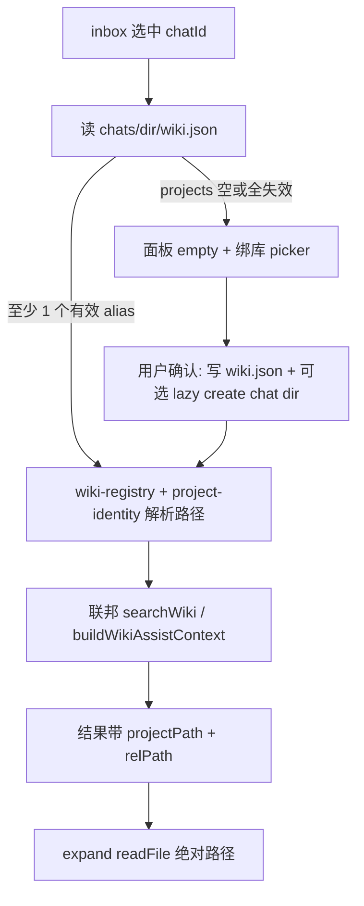

# [M2 · P1] 收件箱 AI 辅助：Per-chat Wiki 联邦检索

> **前置：** [AI 辅助 v2 液态玻璃/UI 落地](../PLAN-console-v2.md) 已合入（中间栏面板、统一 Composer、expand 层）。本票补 **资料源** 与 **会话隔离**，Grill 结论见下文「产品决策」。

**类型：** Feature · Console · Inbox UX  
**优先级：** P1  
**依赖：** Agent per-chat `wiki.json` 约定（`packages/agent`）、`wiki-registry.json`、`read_agent_chat_file` / `write_agent_chat_file`  
**预估：** 3–5 人日

---

## 背景

当前 Console 收件箱 **AI 辅助**与 **Wiki 搜索**共用全局 `useWikiStore.project`——即 Brain/设置里「当前打开」的那一个 Wiki 项目。与 Agent 侧 **per-chat `wiki.json` 映射**（`CONTEXT.md`：Per-chat wiki mapping 归 Agent）不一致。

运维在 inbox 人工回复时，期望：**帮谁查谁的库**；assist 与 search **同一资料源**；多库会话 **联邦检索**（与 Agent `WikiClient.search` 对齐）。

Grill 会话（2026-06）已逐项拍板，本文档为实现规格。

---

## 产品决策（Grill 结论）

| # | 议题 | 决定 |
|---|------|------|
| 1 | Wiki 跟谁走 | **Per-chat `wiki.json`**；assist / search **共用**同一映射 |
| 2 | 多项目 | **联邦检索** `projects[]` 全部库；**RRF 融合排序**（禁止跨库 raw score 直比） |
| 3 | 未绑 / 空映射 | **硬阻断**；不 fallback 全局项目、不 auto-write |
| 4 | 引用 / expand 路径 | **Console 原生**：`{ projectPath, relPath, projectName? }`；expand 用 `readFile(绝对路径)` |
| 5 | 绑库入口 | **面板 empty 内嵌**多选 picker → 写 `wiki.json`；必要时 lazy create chat 目录 |
| 6a | Header | **常驻** `Wiki · A, B`；点击 → 改绑 |
| 6b | Alias 失效 | **部分可用** + ⚠ 提示；**全部失效** → empty 阻断 |
| 7 | Picker 数据源 | **registry ∪ recentProjects**；未注册项选中时 **upsertWikiRegistryEntry** |
| 8 | 切会话状态 | **按 chatId LRU 分桶**（内存，上限 30）；切 chat 关 expand |

---

## 架构安全令牌（微观死角 · 2026-06 校准）

### 1. 联邦分数：RRF，禁止 raw score 混排

**漏洞：** 小库 FAQ（10 篇）Top1 常出 `0.95`，万级大库精确命中可能仅 `0.72`；跨库按 raw score 排序会导致**大库精确结果被小库平庸高分霸榜**。

**令牌：** 联邦层弃用 raw score 全局排序，采用 **Reciprocal Rank Fusion（RRF）**：

\[
\text{RRF}(d) = \sum_{m \in M} \frac{1}{k + r_m(d)}
\]

- \(M\)：参与联邦的库集合；\(r_m(d)\)：文档 \(d\) 在库 \(m\) 内的**排名**（1-based）
- **\(k = 60\)**（与现有单库 Rust search `RRF_K` 一致，见 `commands/search.rs`）
- 单库内仍走现有 hybrid/RRF；**跨库**在 TS `search-wiki-federated.ts` 对各路 ranked list 再做一层 RRF
- UI 展示 `rrfScore`；保留 per-library `score` 仅作 debug

### 2. Store 分桶：LRU 上限 30，防 V8 heap 线性膨胀

**漏洞：** 原生 `Map<chatId, Slice>` 无 eviction；客服一周触达数百 chat，assist 消息 + search 结果常驻 → **Tauri JS heap 暴涨**。

**令牌：**

- 分桶容器改为 **LRU**（max **30** 个 chatId）
- 切换会话：`touch` 当前 id；超限时 evict **最久未访问** slice（非当前 active）
- 被 evict 的会话再切回 → 空白 slice（可接受；与「关 app 丢失」同级）
- 实现：`lib/lru-chat-slice-cache.ts` 或 store 内嵌 doubly-linked + Map

### 3. Lazy create：Rust 原子绑库，禁止 TS 分步 IO

**漏洞：** TS 侧 `mkdir` + 写 `wiki.json` 与 Agent 扫描竞态 → `EBUSY`；仅写 `wiki.json` 无 `meta.json` → Agent 视目录为**坏死会话**。

**令牌：**

- **禁止**前端分步 create/bind
- Tauri 命令 **`ensure_and_bind_agent_chat_dir(chat_id, wiki_json_content)`**：
  - 进程内 **Mutex** 串行化 chat 目录绑定
  - `create_dir_all` → 若新建则 **`ensure_chat_meta`** 写合规 `meta.json` 骨架 → 写 `wiki.json`
  - 校验 `wiki_json_content` 含 `projects: string[]`
  - 返回 `dir_name`（`encode_chat_dir`）
- TS 绑库 picker **只**调此命令

### 4. 联邦 Context：按库均分 + 交织裁剪（Token Budget Interleaving）

**漏洞：** 单库「按分数贪婪塞满 budget」时，一个大长文库可榨干 window，**挤掉**其他库的线索。

**令牌：** 升级 `buildWikiAssistContext` 多库路径：

- 总 budget \(B\)（沿用 `computeContextBudget`）→ 每库配额 \(B / |M|\)（下限保留 index 摘要位）
- 页面片段 **交织提取**：A Rank1 → B Rank1 → A Rank2 → B Rank2 …
- 每片段 **per-chunk cap**（字符上限），防止单页 4000 字吞噬单库配额
- 单库退化时行为与现实现一致

---

## 目标

### 数据流



### 行为摘要

1. 打开 AI 辅助 → 读当前 inbox `chatId` 的 `wiki.json` → 解析 alias → 联邦搜/问。
2. **未绑 Wiki**（无目录 / `projects: []` / 全 alias 失效）→ 面板 **empty**，主 CTA **绑库**（不 silent 用全局项目）。
3. **已绑** → header 显示 `Wiki · 工作, FAQ`；失效 alias 标 ⚠，toast 说明；至少一库有效则照常。
4. **绑库 picker** → 列表 = `wiki-registry.json` alias ∪ Console `recentProjects`；选未注册 recent 项 → `upsertWikiRegistryEntry` → 写 `wiki.json` 的 `projects: string[]`。
5. **切 inbox 会话** → assist 对话、assistDraft、searchQuery、submittedSearch、lastMode **按 chatId 分桶恢复**；**关闭 expand**。
6. **引用卡片 / 搜索结果** → 携带 `projectPath` + `relPath`；expand 直接读盘，不复刻 Agent HTTP alias 协议。

---

## 现状 vs 目标

| 项 | 现状 | 目标 |
|----|------|------|
| 资料源 | 全局 `useWikiStore.project` | per-chat `wiki.json` + 联邦 |
| 未绑 Wiki | 可能仍搜全局库 / `noProject` 文案 | 硬阻断 + 内嵌绑库 |
| 多库 | 单库 | 联邦 merge |
| 切 chat | 只清 assist 消息；search 串会话 | 全状态分桶 + 恢复 |
| expand | 单 global project 路径猜测 | 绝对路径 |
| 绑库 UI | 无 | 面板 empty picker |

---

## 验收标准

> **验收记录（2026-06-16）**  
> - 自动化：`pnpm --filter console exec tsc -b` ✅；M2 P1 单测 **38** 项 ✅（含 `m2-p1-acceptance.test.ts` 双库 smoke）  
> - 收件箱 AI 路径**不**读取 `useWikiStore.project` 作资料源（仅 LLM/searchApi 配置）  
> - **待人工点验（Tauri UI）**：见文末 [手动 QA 清单](#手动-qa-清单)

### Per-chat Wiki

- [x] 会话 A、B 配置不同 `wiki.json` → assist 回答与 search 结果分别来自对应库（可测：两库各放唯一词条）
- [x] assist 与 search **同一 chat** 下资料源一致（header 显示相同 alias 列表）
- [x] `projects: ["A","B"]` → 两库均有代表结果；**RRF 排序**下小库不会仅因 raw score 霸榜（单测：构造 score 反差 fixture）

### 硬阻断（Grill #3）

- [x] 无 `wiki.json` 或 `projects: []` → 仅 empty + 绑库，**不**调用 `searchWiki` / `buildWikiAssistContext`
- [x] **不** fallback 到 `useWikiStore.project`

### 绑库（Grill #5 + #7）

- [x] empty 态多选 picker → 写 `wiki.json`；绑完立即可搜
- [x] chat 目录不存在时绑库 → **`ensure_and_bind_agent_chat_dir`** 原子写 `meta.json` + `wiki.json`
- [x] recent 中未注册项目可选 → 自动 `upsertWikiRegistryEntry`，`wiki.json` 存 **alias**

### Header / 失效（Grill #6）

- [x] 已绑会话 header 常驻 `Wiki · …`；点击可改绑
- [x] 部分 alias 失效 → 其余库可搜 + ⚠；**全部失效** → empty

### 状态分桶（Grill #8）

- [x] chat A 搜「退款」→ 切 B → 再切 A → 恢复 A 的 search 草稿/结果与 assist 对话（在 LRU 30 内）
- [x] 切 chat 时 expand **关闭**
- [x] 连续切换 >30 个不同 chat 后进程内存无线性增长（LRU eviction smoke）

### Expand / 引用（Grill #4）

- [x] 联邦结果点引用 → expand 正确渲染 `.md`（`FilePreview` markdown 分支）
- [x] 路径为绝对 `projectPath/relPath`，非 Agent `alias/path` 字符串

### 回归

- [x] 已绑会话：液态玻璃 UI、Composer 无缝切换、列表 pointer-events 阻断不受影响
- [x] `pnpm --filter console exec tsc -b`；resolve / RRF / LRU 单测

### 联邦 Context（架构令牌 #4）

- [x] 双库绑定 + 一大长文库 + 一短词条库 → assist prompt 中两库均有片段（交织单测）

---

## 刻意不做（本票范围外）

- AI 会话 / 草稿 **localStorage 持久化**（LRU evict / 关 app 均丢失）
- Console **auto-bind** 写 `wiki.json`（与 Grill #3 硬阻断一致；绑库仅用户 explicit + Rust 命令）
- Agent wire 格式 `alias/wiki/foo.md` 作为 expand 主路径（内部用绝对路径）

---

## 实现要点

### 1. `useInboxChatWiki`（新 hook）

路径：`apps/console/src/hooks/use-inbox-chat-wiki.ts`

- `encodeChatDir(chatId)` → `readAgentChatFile(dir, "wiki.json")`
- 解析 `{ projects: string[] }`；读 `wiki-registry.json` + `loadRegistry` / `getProjectPathById`
- 返回：
  ```ts
  type InboxChatWikiStatus = "loading" | "unbound" | "broken" | "partial" | "ok"
  type ResolvedWikiProject = { alias: string; projectId: string; projectPath: string; name?: string }
  ```
- **不** auto-bind（Grill #3）

### 2. 联邦检索（RRF）

| 模块 | 改动 |
|------|------|
| `apps/console/src/lib/search-wiki-federated.ts`（新） | 每库 `searchWiki` → 取 ranked list → **跨库 RRF**（\(k=60\)）→ `{ projectPath, relPath, title, snippet, rrfScore, libraryRank, projectName }` |
| `apps/console/src/lib/search-wiki-rrf.ts`（新） | 纯函数 RRF merge + 单测（小库高分 vs 大库低分 fixture） |
| `apps/console/src/lib/wiki-assist.ts` | 多项目 + **Token Budget Interleaving**（见架构令牌 #4） |

单库内 RRF 已在 Rust `commands/search.rs`；联邦层在 TS 对**多路排名**再融合。参考 Agent 分库 loop：`packages/agent/src/wiki-client.ts`。

### 2b. Rust 原子绑库

| 模块 | 改动 |
|------|------|
| `apps/console/src-tauri/src/agent_config.rs` | `ensure_and_bind_agent_chat_dir` + `CHAT_DIR_BIND_LOCK: Mutex<()>` |
| `apps/console/src/lib/agent-config-client.ts` | `ensureAndBindAgentChatDir(chatId, wikiJson)` |

### 3. UI 组件

| 组件 | 职责 |
|------|------|
| `inbox-ai-wiki-bind-picker.tsx` | 多选；数据源 registry ∪ `getRecentProjects()`；保存写 `wiki.json` |
| `inbox-ai-wiki-header.tsx` | 常驻 alias 条；⚠ 失效；点击改绑 |
| `inbox-ai-assist-overlay.tsx` | 接入 hook；empty / partial / ok 分支；expand 绝对路径 |

绑库写盘：**仅** `ensureAndBindAgentChatDir(chatId, JSON.stringify({ projects }))` — 禁止 TS 分步 `writeAgentChatFile`。

### 4. Store 分桶（LRU）

`apps/console/src/stores/ai-assist-store.ts` + `apps/console/src/lib/lru-chat-slice-cache.ts`：

```ts
type ChatAiAssistSlice = {
  messages: AiAssistMessage[]
  assistDraft: string
  searchQuery: string
  submittedSearch: string
  lastMode: AiAssistMode
}
// LRU max 30 chatIds; touch on switch; evict LRU entry
```

- `onInboxChatChanged`：persist 旧桶 → load 新桶 → `closeExpand()` → `abortInflight()`
- 移除「切 chat 只 resetSession 清 messages」的半成品逻辑

### 5. Expand 类型

`AiAssistExpand` 扩展：

```ts
| { kind: "wiki"; path: string; title?: string; projectPath?: string }
```

`WikiExpandPanel`：有 `projectPath` 时直接 `readFile(join(projectPath, rel))`，去掉对 global `useWikiStore.project` 的候选路径链。

### 6. i18n

`wechat.aiAssist.*` 新增：

- `wikiUnboundTitle` / `wikiUnboundHint` / `wikiBindAction`
- `wikiHeaderLabel` / `wikiPartialInvalid`（含 `{aliases}`）
- `wikiBrokenTitle`

---

## 建议 PR 切片

| PR | 内容 |
|----|------|
| **2** | `useInboxChatWiki` + `resolve-inbox-chat-wiki.ts` + **`ensure_and_bind_agent_chat_dir`（Rust）** |
| **2.1** | Rust 原子绑库命令 + TS client + 单测（meta 骨架、wiki 校验、Mutex） |
| **3** | Store **LRU 分桶**（max 30）+ 修 search 串会话 |
| **3.1** | `lru-chat-slice-cache.ts` + store 接入 + eviction 单测 |
| **4** | 联邦 search  wiring（多库调用） |
| **4.1** | **`search-wiki-rrf.ts`** 跨库 RRF 融合 + score 霸榜 regression 单测 |
| **4.2** | **`buildWikiAssistContext`** 多库交织 budget + 单测 |
| **5** | UI bind picker + header + overlay 分支 |
| **6** | expand 绝对路径 + 引用 metadata |

---

## 相关文件

| 路径 | 说明 |
|------|------|
| `apps/console/src/stores/ai-assist-store.ts` | 分桶、onInboxChatChanged |
| `apps/console/src/components/wechat/inbox-ai-assist-overlay.tsx` | empty / header / expand |
| `apps/console/src/hooks/use-inbox-ai-assist-send.ts` | 改读 per-chat resolved projects |
| `apps/console/src/components/wiki/wiki-search-workspace.tsx` | embedded + federated results |
| `apps/console/src/hooks/use-inbox-chat-wiki.ts` | per-chat wiki 加载 hook |
| `apps/console/src/lib/resolve-inbox-chat-wiki.ts` | alias 解析纯函数 |
| `apps/console/src/lib/agent-config-client.ts` | `ensureAndBindAgentChatDir` |
| `apps/console/src/lib/search-wiki-rrf.ts` | 跨库 RRF |
| `apps/console/src/lib/search-wiki-federated.ts` | 联邦 search 编排 |
| `apps/console/src/lib/lru-chat-slice-cache.ts` | 分桶 LRU |
| `apps/console/src-tauri/src/agent_config.rs` | `ensure_and_bind_agent_chat_dir` |
| `packages/agent/src/chat-store.ts` | `wiki.json` schema 参考 |
| `packages/agent/src/wiki-client.ts` | 联邦 search 行为参考 |
| `CONTEXT.md` | Per-chat wiki mapping 域语言 |

---

## 风险与兜底

| 风险 | 兜底 |
|------|------|
| chat 目录从未被 Agent 创建 | **Rust 原子绑库**；未绑则阻断 |
| registry 与磁盘路径不同步 | partial 态 + ⚠；引导改绑 |
| 跨库 raw score 不可比 | **联邦 RRF**（\(k=60\)） |
| 大库长文吞噬 context | **交织 budget + per-chunk cap** |
| 分桶内存膨胀 | **LRU max 30** |
| TS/Rust 绑库竞态 | **Mutex + 单命令**；禁止 TS 分步 mkdir |
| 与 Agent auto-bind 竞态 | Console 仅 explicit 绑库；不覆盖非空 `projects` 除非用户改绑 |

---

## 手动 QA 清单

> 在 Tauri 收件箱中点验；自动化 smoke 见 `apps/console/src/lib/m2-p1-acceptance.test.ts`。

| # | 步骤 | 期望 |
|---|------|------|
| 1 | 库 A / 库 B 各建唯一词条；会话 A `wiki.json`→A，会话 B→B | 同词搜索，A 只出 A 词条，B 只出 B 词条 |
| 2 | 单会话绑 `["A","B"]`，搜索两库均有词 | 结果带库名前缀；RRF 排序合理 |
| 3 | 未绑会话打开 AI 辅助 | empty + picker；Composer 禁用；无搜索结果 |
| 4 | empty 内多选绑库 → 保存 | 立即可搜；header `Wiki · …` |
| 5 | 新 chat（无目录）绑库 | `data/chats/.../meta.json` + `wiki.json` 同时存在 |
| 6 | chat A 搜「退款」→ 切 B → 再切 A | A 的 search 草稿/结果与 assist 对话恢复 |
| 7 | A 打开 expand → 切 B | expand 关闭 |
| 8 | 联邦结果 / assist 引用点击 | expand 渲染 `.md`；DevTools 无 alias 路径 |

**自动化复跑：**

```bash
cd apps/console && pnpm exec tsc -b && pnpm exec vitest run \
  src/lib/m2-p1-acceptance.test.ts \
  src/lib/resolve-inbox-chat-wiki.test.ts \
  src/lib/search-wiki-rrf.test.ts \
  src/lib/search-wiki-federated.test.ts \
  src/lib/lru-chat-slice-cache.test.ts \
  src/lib/wiki-assist-interleave.test.ts \
  src/lib/wiki-reference-path.test.ts \
  src/stores/ai-assist-store.test.ts
```

---

## PR 合入说明

| PR 切片 | 状态 |
|---------|------|
| 2 · per-chat hook + Rust 绑库 | ✅ 已落地 |
| 3 · LRU 分桶 | ✅ |
| 4.1 · 跨库 RRF | ✅ |
| 4.2 · assist 交织 budget | ✅ |
| 5 · UI picker / header / overlay | ✅ |
| 6 · expand 绝对路径 + 引用 metadata | ✅ |

建议单 PR 标题：**`feat(console): M2 P1 per-chat wiki federated search`**  
合入前：提交上述 M2 P1 相关文件 + 跑手动 QA 清单 #1–#8。
