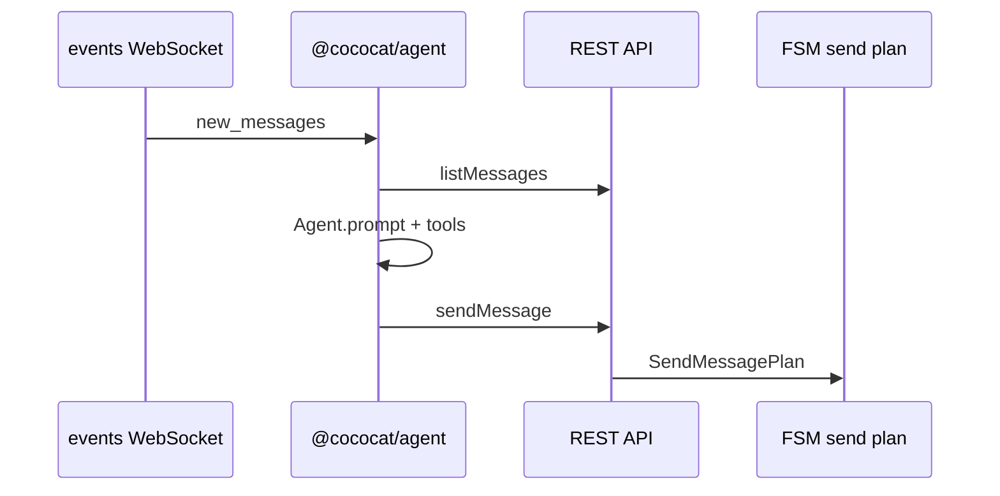

CocoCat uses a **two-tier** design: the container drives WeChat; the host runs the pi Agent.

## Roles

| Component | Location | Role |
|-----------|----------|------|
| **CocoCat Driver** | Docker container (`agent-wechat` image) | Channel driver — REST, FSM, DB, UI automation |
| **CocoCat Agent** | Host (`@cococat/agent`) | Agent runtime — [pi-agent-core](https://github.com/earendil-works/pi) + WeChat tools |

There is **no LLM inside the container**. The former in-container Bridge chatbot has been removed.

## Recommended setup

```
pnpm agent (host)  ──HTTP/WS──▶  wx up / stack (container)  ──▶  WeChat
```

1. Start Driver: `pnpm stack start driver` or `wx up`
2. Start Agent: `pnpm agent` (or Console **Stack** panel)
3. Configure LLM keys in `~/.config/cococat/agent.env` or env vars

See [Pi Agent Setup](/integrations/pi/setup).

## Control flow



## FSM vs Agent

| Layer | Module | Uses LLM? |
|-------|--------|-----------|
| UI automation | `plans/` + `execution/` | No |
| Conversation | `packages/agent/` | Yes (pi-ai) |

Do not confuse FSM **Plan** (deterministic UI steps) with pi **Agent** (language reasoning).

## Legacy note

OpenClaw integration was removed from this fork. Use `@cococat/agent` or the [REST API](/reference/api) directly for custom agents.
