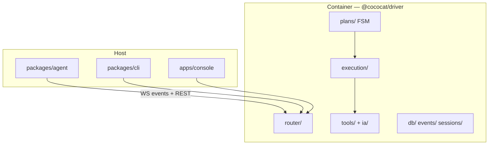

The monorepo root **`CONTEXT.md`** (Chinese) is the canonical glossary.

For setup, see [Pi Agent Setup](/integrations/pi/setup) and [Agent Architecture](/how-it-works/agent-path/).

## Product roles

| Name | Role |
|------|------|
| **CocoCat Driver** | Container **channel driver** — REST, FSM, DB, UI automation (`packages/driver`, Docker image `agent-wechat`) |
| **CocoCat Agent** | Host **Agent runtime** — `@cococat/agent`, `@earendil-works/pi-agent-core` |
| **CocoCat Wiki** | Knowledge base HTTP API `:19828` (Wiki module in Console) |
| **CocoCat Memory** | Long-term memory sidecar `:8420` |
| **CocoCat Console** | Tauri desktop app — Wiki / WeChat / Memory / Stack |

There is **no LLM in the container**. Bridge/chatbot code was removed.

## Stack diagram



## Container layers

### 1. Access — `router/`

REST + WebSocket (`/api/ws/login`, `/api/ws/events`).

### 2. FSM planning — `plans/`

Deterministic `Plan::select_action()` — no LLM.

### 3. Execution — `execution/` + `ia/` + `tools/`

Nine-step UI automation loop.

### 4. Infrastructure

`db/`, `events.rs` (broadcasts `new_messages` to WS clients), `sessions/`.

## Host layer — CocoCat Agent

| File | Role |
|------|------|
| `monitor.ts` | Subscribe to `/api/ws/events`, poll fallback |
| `session.ts` | One pi `Agent` per chat |
| `tools.ts` | WeChat tools for pi |

## Control flow

```
events WS → @cococat/agent → Agent.prompt + tools → REST send → FSM → WeChat UI
```

## CocoCat Console

Single desktop entry: Wiki editing, WeChat ops (QR, VNC, read-only chats), Memory debug, one-click stack start/stop.

Config: `~/.config/cococat/` · Data: `~/.local/share/cococat/`
